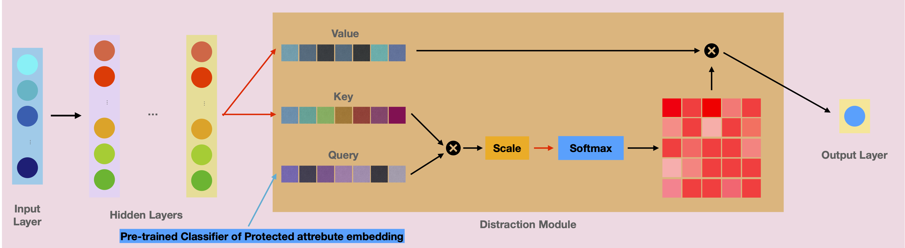
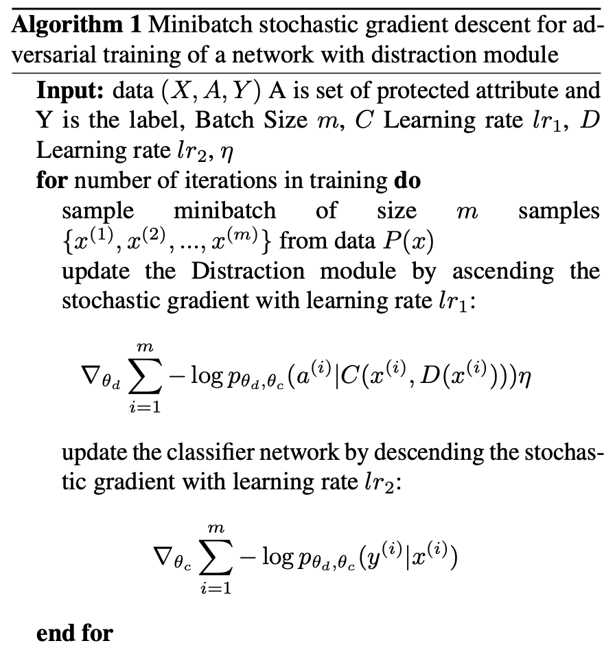
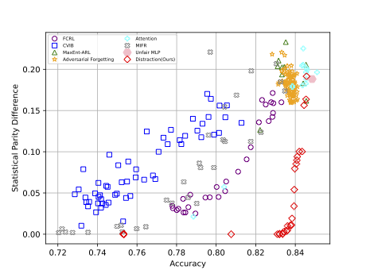
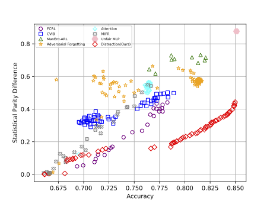

# This repository is deprecated! Please refer to the published paper "Fair Bilevel Neural Network (FairBiNN): On Balancing fairness and accuracy via Stackelberg Equilibrium" [link](https://arxiv.org/abs/2410.16432) and [Github page]("https://github.com/yazdanimehdi/FairBiNN")

# Distraction Is All You Need For Fairness
This is The repository for supporting matterial of "Distraction is All You Need for Fairness" [link](https://arxiv.org/abs/2203.07593)

## Architecture


## Training Algorithm

## Requirements
For installing the requirements run:
```
pip install -r requirements.txt
```
## Replicating the results
For running the model
run:
```
python ablation_study.py --eta --data --fairness_layers --acc_layers --fairness_position --device --epochs --fairness_learning_rate --network_learning_rate --batch_size
```

For running the model with distraction module run:
### UCI Adult dataset:
```
python attribute_classifier.py
```
### Heritage Health dataset:
```
python attribute_classifier_health.py
```

## Results
### Adult Dataset


## Health Heritage Dataset

